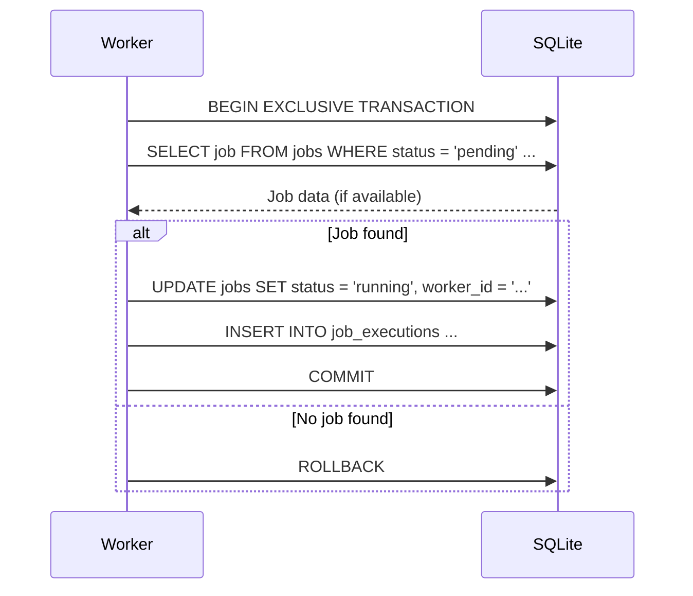
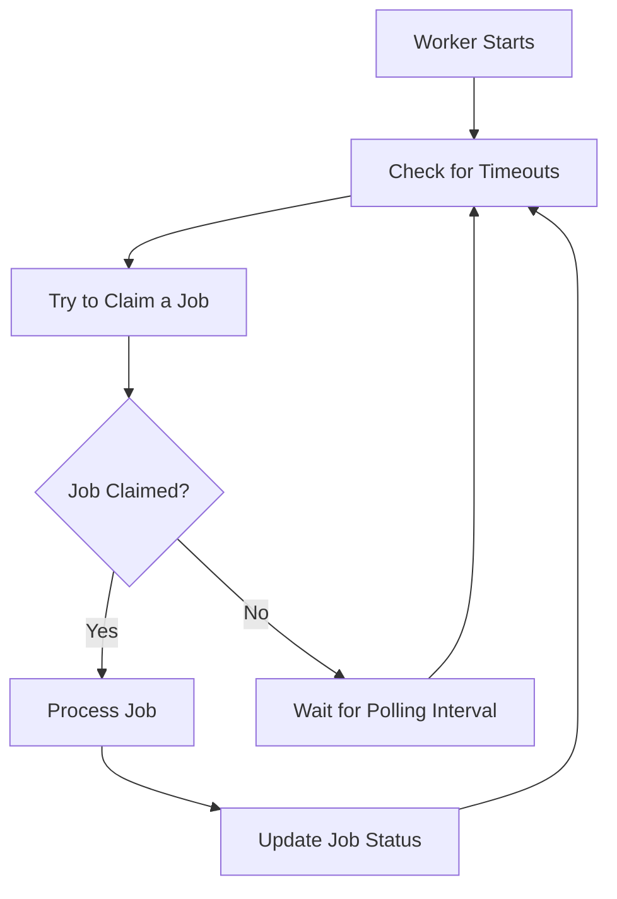

# Concurrency in GigQ

This page explains how GigQ handles concurrent job processing, the SQLite locking mechanisms it relies on, and best practices for running multiple workers.

## Overview

GigQ is designed to support concurrent job processing with multiple workers while ensuring that:

1. Each job is processed exactly once (no duplicate processing)
2. Job state transitions are atomic (all-or-nothing)
3. Job dependencies are respected
4. System resources are used efficiently

This is achieved through a combination of SQLite's transaction isolation, explicit locks, and careful job claiming design.

## How Job Claiming Works

The job claiming process is the cornerstone of GigQ's concurrency model:



Key points in this process:

1. The entire claim operation occurs in an **exclusive transaction**
2. Workers query for jobs based on status, dependencies, and priority
3. When a job is claimed, its status is updated and an execution record is created
4. The transaction is committed, making the claim visible to other workers
5. If no suitable job is found, the transaction is rolled back

This process ensures that even if multiple workers attempt to claim the same job simultaneously, only one will succeed.

## SQLite Locking Mechanisms

GigQ relies on SQLite's locking mechanisms to ensure safe concurrent access:

### Transaction Isolation Levels

SQLite supports several transaction modes:

- **DEFERRED** (default): Locks are acquired when needed
- **IMMEDIATE**: A reserved lock is acquired immediately
- **EXCLUSIVE**: An exclusive lock is acquired immediately

GigQ uses **EXCLUSIVE** transactions for job claiming to prevent race conditions.

### Lock Types

SQLite uses a lock escalation system with five lock states:

1. **UNLOCKED**: No locks are held (initial state)
2. **SHARED**: Multiple readers can access the database
3. **RESERVED**: Writer has reserved the right to modify the database
4. **PENDING**: Writer is waiting for readers to finish
5. **EXCLUSIVE**: Writer has exclusive access to modify the database

When GigQ claims a job, it obtains an EXCLUSIVE lock for the duration of the transaction, ensuring no other workers can modify the database during the critical section.

### Connection Timeout

GigQ configures SQLite connections with a timeout (default: 30 seconds). If a connection cannot obtain the required lock within this timeout, it will raise an error.

This timeout is important for preventing deadlocks and ensuring workers don't wait indefinitely for locks.

## Concurrent Worker Operation

When running multiple workers, they follow this general workflow:



Multiple workers can execute this cycle simultaneously, with SQLite's locking ensuring that:

1. Only one worker claims each job
2. Workers don't interfere with each other's database operations
3. Job state is consistent across all workers

## Handling Worker Crashes

If a worker crashes while processing a job, the job remains in the "running" state. GigQ handles this through a timeout detection mechanism:

1. When any worker starts (or periodically), it checks for jobs that have been running longer than their timeout
2. If such jobs are found, they are marked as timed out or requeued for retry
3. This ensures that jobs don't remain stuck in the running state indefinitely

```python
# Example of timeout detection (simplified from GigQ's implementation)
def check_for_timeouts(queue):
    with sqlite3.connect(queue.db_path) as conn:
        cursor = conn.execute(
            """
            SELECT id, timeout, started_at, attempts, max_attempts
            FROM jobs
            WHERE status = 'running'
            """
        )

        now = datetime.now()
        for job in cursor.fetchall():
            started_at = datetime.fromisoformat(job["started_at"])
            timeout = job["timeout"] or 300  # Default 5 minutes

            if now - started_at > timedelta(seconds=timeout):
                # Job has timed out
                status = "pending" if job["attempts"] < job["max_attempts"] else "timeout"

                conn.execute(
                    """
                    UPDATE jobs
                    SET status = ?, updated_at = ?, worker_id = NULL
                    WHERE id = ?
                    """,
                    (status, now.isoformat(), job["id"])
                )
```

## Job Dependencies and Concurrent Processing

GigQ ensures that dependent jobs only run after their dependencies have completed:

1. When looking for jobs to claim, workers check that a job's dependencies are all completed
2. This check is done within the same exclusive transaction used for claiming the job
3. This ensures that job dependencies are respected even with concurrent workers

```python
# Example of dependency checking (simplified from GigQ's implementation)
def check_dependencies(conn, dependencies):
    if not dependencies:
        return True

    placeholders = ",".join(["?"] * len(dependencies))
    query = f"""
        SELECT COUNT(*) as count
        FROM jobs
        WHERE id IN ({placeholders})
        AND status != 'completed'
    """

    cursor = conn.execute(query, dependencies)
    result = cursor.fetchone()

    # If count is 0, all dependencies are completed
    return result["count"] == 0
```

## Concurrency Limitations

While GigQ's concurrency model works well for most use cases, there are some limitations to be aware of:

### SQLite Concurrency Limits

SQLite uses file-level locking, which can become a bottleneck with many concurrent workers. The exact limit depends on:

- Hardware (especially disk I/O)
- Job processing duration
- Polling frequency
- SQLite configuration

### Network Filesystem Considerations

If the SQLite database is on a network filesystem (NFS, SMB, etc.), be aware that:

1. Locking behavior may be less reliable
2. Performance may be significantly slower
3. Some network filesystems don't properly support SQLite's locking protocol

For best results, store the database file on local storage when possible.

## Optimizing Concurrency

Here are strategies to optimize concurrency with GigQ:

### 1. Adjust Worker Count

The optimal number of workers depends on:

- CPU cores available
- Nature of your jobs (CPU-bound, I/O-bound, etc.)
- Other system resources (memory, disk I/O)

For CPU-bound jobs, a good starting point is one worker per CPU core. For I/O-bound jobs, you might use more.

### 2. Tune Polling Intervals

The polling interval affects how often workers check for new jobs:

- **Shorter intervals** reduce job latency but increase database load
- **Longer intervals** reduce database load but increase job latency

Find a balance that works for your workload.

```python
# Worker with a custom polling interval
worker = Worker("jobs.db", polling_interval=2)  # Check every 2 seconds
```

### 3. Use Job Priorities

Prioritize jobs to ensure important work gets processed first:

```python
# High priority job
urgent_job = Job(
    name="urgent_task",
    function=process_urgent,
    priority=100  # Higher number = higher priority
)

# Low priority job
background_job = Job(
    name="background_task",
    function=process_background,
    priority=-10  # Lower number = lower priority
)
```

### 4. Implement Batching

For many small jobs, consider batching them to reduce overhead:

```python
def process_batch(items):
    results = []
    for item in items:
        results.append(process_item(item))
    return results

# Submit a batch job instead of many small jobs
batch_job = Job(
    name="process_batch",
    function=process_batch,
    params={"items": items_to_process}
)
```

### 5. Use Appropriate Timeouts

Set job timeouts based on expected execution time:

```python
# Short-running job
quick_job = Job(
    name="quick_task",
    function=quick_function,
    timeout=60  # 1 minute
)

# Long-running job
long_job = Job(
    name="long_task",
    function=long_function,
    timeout=3600  # 1 hour
)
```

## Advanced Concurrency Patterns

### Worker Specialization

You can create specialized workers that focus on specific types of jobs:

```python
class HighPriorityWorker(Worker):
    """Worker that only processes high-priority jobs."""

    def _claim_job(self):
        conn = self._get_connection()
        try:
            conn.execute("BEGIN EXCLUSIVE TRANSACTION")

            cursor = conn.execute(
                """
                SELECT * FROM jobs
                WHERE status = ? AND priority >= 50
                ORDER BY priority DESC, created_at ASC
                LIMIT 1
                """,
                (JobStatus.PENDING.value,)
            )

            # Rest of the method follows the original implementation...
```

### Job Categories

You can implement job categories by using separate queue databases:

```python
# Create separate queues for different job types
urgent_queue = JobQueue("urgent_jobs.db")
background_queue = JobQueue("background_jobs.db")

# Create workers for each queue
urgent_worker = Worker("urgent_jobs.db")
background_worker = Worker("background_jobs.db")
```

### Distributed Workers

While GigQ is primarily designed for local job processing, you can run workers on different machines if they all have access to the same database file. This could be through:

- Network file shares (with the limitations noted earlier)
- Cloud storage solutions that support SQLite (with appropriate caching)
- Custom synchronization mechanisms

## Monitoring Concurrency

To monitor the concurrency of your GigQ setup:

```python
def monitor_workers(queue):
    """Print information about active workers and job distribution."""
    running_jobs = queue.list_jobs(status="running")

    # Group by worker
    workers = {}
    for job in running_jobs:
        worker_id = job.get("worker_id")
        if worker_id:
            if worker_id not in workers:
                workers[worker_id] = []
            workers[worker_id].append(job)

    print(f"Active workers: {len(workers)}")
    for worker_id, jobs in workers.items():
        print(f"  Worker {worker_id}: {len(jobs)} jobs")

    # Show job status distribution
    statuses = ["pending", "running", "completed", "failed", "cancelled", "timeout"]
    counts = {}

    for status in statuses:
        jobs = queue.list_jobs(status=status)
        counts[status] = len(jobs)

    print("\nJob status distribution:")
    for status, count in counts.items():
        print(f"  {status}: {count}")
```

## Best Practices Summary

1. **Start with a reasonable number of workers** based on your system resources and job characteristics.

2. **Monitor database contention** and adjust worker count and polling intervals if needed.

3. **Use appropriate timeouts** to ensure jobs don't get stuck.

4. **Be cautious with network filesystems** - test thoroughly and consider alternatives.

5. **Use job priorities** to ensure important work is processed first.

6. **Consider batching** for many small jobs to reduce overhead.

7. **Implement appropriate error handling** to make jobs resilient to transient failures.

8. **Monitor worker health** and job processing metrics.

## Next Steps

Now that you understand how GigQ handles concurrency, you might want to explore:

- [Performance Optimization](performance.md) - Additional strategies for optimizing performance
- [Custom Job Types](custom-job-types.md) - Creating specialized job types
- [SQLite Schema](sqlite-schema.md) - Understanding the underlying database schema
