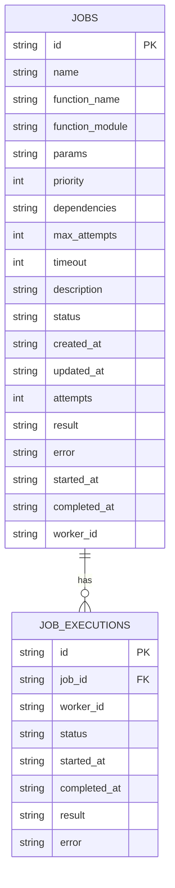
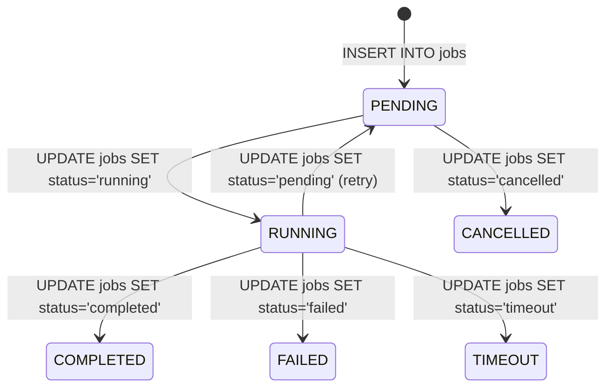

# SQLite Schema

GigQ uses SQLite as its backend storage. This page details the database schema and explains how it's used to manage jobs and their executions.

## Overview

The database consists of two main tables:

1. `jobs` - Stores job definitions and current state
2. `job_executions` - Tracks individual execution attempts

This simple, efficient schema is designed to balance simplicity with the features needed for reliable job processing.

## Tables Structure

### Jobs Table

The `jobs` table stores the core information about each job:

```sql
CREATE TABLE IF NOT EXISTS jobs (
    id TEXT PRIMARY KEY,
    name TEXT NOT NULL,
    function_name TEXT NOT NULL,
    function_module TEXT NOT NULL,
    params TEXT,
    priority INTEGER DEFAULT 0,
    dependencies TEXT,
    max_attempts INTEGER DEFAULT 3,
    timeout INTEGER DEFAULT 300,
    description TEXT,
    status TEXT NOT NULL,
    created_at TEXT NOT NULL,
    updated_at TEXT NOT NULL,
    attempts INTEGER DEFAULT 0,
    result TEXT,
    error TEXT,
    started_at TEXT,
    completed_at TEXT,
    worker_id TEXT
)
```

#### Field Descriptions

| Field             | Type    | Description                                                                  |
| ----------------- | ------- | ---------------------------------------------------------------------------- |
| `id`              | TEXT    | Unique identifier for the job (UUID)                                         |
| `name`            | TEXT    | Human-readable name for the job                                              |
| `function_name`   | TEXT    | Name of the function to execute                                              |
| `function_module` | TEXT    | Module containing the function                                               |
| `params`          | TEXT    | JSON-encoded parameters to pass to the function                              |
| `priority`        | INTEGER | Execution priority (higher values execute first)                             |
| `dependencies`    | TEXT    | JSON-encoded list of job IDs that must complete before this job can run      |
| `max_attempts`    | INTEGER | Maximum number of execution attempts                                         |
| `timeout`         | INTEGER | Maximum execution time in seconds                                            |
| `description`     | TEXT    | Optional description of the job                                              |
| `status`          | TEXT    | Current job status (pending, running, completed, failed, cancelled, timeout) |
| `created_at`      | TEXT    | ISO-format timestamp of job creation                                         |
| `updated_at`      | TEXT    | ISO-format timestamp of last update                                          |
| `attempts`        | INTEGER | Number of execution attempts                                                 |
| `result`          | TEXT    | JSON-encoded result of the job (if completed)                                |
| `error`           | TEXT    | Error message (if failed)                                                    |
| `started_at`      | TEXT    | ISO-format timestamp of when the job started running                         |
| `completed_at`    | TEXT    | ISO-format timestamp of when the job completed                               |
| `worker_id`       | TEXT    | ID of the worker processing the job (if running)                             |

### Job Executions Table

The `job_executions` table tracks individual execution attempts:

```sql
CREATE TABLE IF NOT EXISTS job_executions (
    id TEXT PRIMARY KEY,
    job_id TEXT NOT NULL,
    worker_id TEXT NOT NULL,
    status TEXT NOT NULL,
    started_at TEXT NOT NULL,
    completed_at TEXT,
    result TEXT,
    error TEXT,
    FOREIGN KEY (job_id) REFERENCES jobs (id)
)
```

#### Field Descriptions

| Field          | Type | Description                                                    |
| -------------- | ---- | -------------------------------------------------------------- |
| `id`           | TEXT | Unique identifier for the execution (UUID)                     |
| `job_id`       | TEXT | ID of the job being executed                                   |
| `worker_id`    | TEXT | ID of the worker executing the job                             |
| `status`       | TEXT | Status of this execution (running, completed, failed, timeout) |
| `started_at`   | TEXT | ISO-format timestamp of when execution started                 |
| `completed_at` | TEXT | ISO-format timestamp of when execution completed (if finished) |
| `result`       | TEXT | JSON-encoded result of the execution (if completed)            |
| `error`        | TEXT | Error message (if failed)                                      |

## Indexes

GigQ creates several indexes to optimize common operations:

```sql
CREATE INDEX IF NOT EXISTS idx_jobs_status ON jobs (status)
CREATE INDEX IF NOT EXISTS idx_jobs_priority ON jobs (priority)
```

These indexes allow for efficient:

- Retrieval of jobs by status (e.g., finding all pending jobs)
- Ordering of jobs by priority

## Serialization

Several fields in the schema store serialized data:

| Field          | Format     | Example                                      |
| -------------- | ---------- | -------------------------------------------- |
| `params`       | JSON       | `{"filename": "data.csv", "threshold": 0.7}` |
| `dependencies` | JSON array | `["job-id-1", "job-id-2"]`                   |
| `result`       | JSON       | `{"processed": true, "count": 42}`           |

## Schema Visualization

Here's a visual representation of the database schema:



## How GigQ Uses the Schema

### Job Claiming

When a worker claims a job:

1. It starts an exclusive transaction
2. Finds a pending job with no dependencies or with all dependencies completed
3. Updates the job's status to "running", increments the attempts count, and sets the worker_id
4. Creates a new record in job_executions
5. Commits the transaction

This ensures that only one worker claims each job.

### State Transitions

The following diagram illustrates how job states are represented in the database:



### Handling Dependencies

Job dependencies are stored as a JSON array of job IDs in the `dependencies` field. When a worker looks for jobs to process, it checks:

1. Are there any pending jobs with no dependencies?
2. If not, are there pending jobs where all dependencies are completed?

This query is optimized using indexes on the `jobs` table.

## Working with the Schema Directly

While GigQ's API abstracts the database operations, you can interact with the schema directly for advanced use cases:

```python
import sqlite3
import json

# Connect to the database
conn = sqlite3.connect("gigq.db")
conn.row_factory = sqlite3.Row

# Get statistics about jobs
cursor = conn.execute("""
    SELECT status, COUNT(*) as count
    FROM jobs
    GROUP BY status
    ORDER BY count DESC
""")
stats = {row['status']: row['count'] for row in cursor.fetchall()}
print(stats)

# Find stalled jobs (running for too long)
cursor = conn.execute("""
    SELECT id, name, started_at
    FROM jobs
    WHERE status = 'running'
    AND datetime(started_at) < datetime('now', '-1 hour')
""")
stalled_jobs = [dict(row) for row in cursor.fetchall()]
print(stalled_jobs)

conn.close()
```

## Schema Migrations

The schema is initialized when a `JobQueue` is created. The current version of GigQ doesn't include explicit schema migrations, so if you need to modify the schema:

1. Backup your database
2. Make changes manually or create a migration script
3. Update your GigQ code to work with the modified schema

In future versions, GigQ may include more formal schema migration support.

## Performance Considerations

SQLite performs well for most local job processing needs, but consider these factors:

- **Database Size**: If you'll be processing millions of jobs, consider adding a periodic cleanup process
- **Concurrency**: SQLite's locking model works well for moderate concurrency (a few dozen workers)
- **Disk Speed**: Since SQLite is file-based, disk I/O can impact performance

## Next Steps

Now that you understand the database schema, you might want to explore:

- [Concurrency](concurrency.md) - Learn how GigQ handles concurrent job processing
- [Performance](performance.md) - Tips for optimizing performance
- [Custom Job Types](custom-job-types.md) - How to extend GigQ with custom job types
