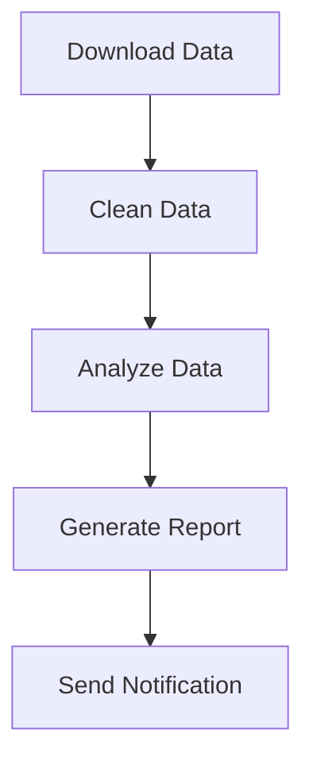

# Data Processing Pipeline Example

This example demonstrates how to use GigQ to build a data processing pipeline that downloads, processes, and analyzes CSV data.

## Overview

This data processing pipeline:

1. Downloads a CSV file from a remote source
2. Cleans and transforms the data
3. Performs analysis and generates reports
4. Stores results in a database
5. Sends a notification when complete

## Complete Example

Here's the full code example:

```python
"""
Example of a data processing pipeline using GigQ.
"""
import os
import pandas as pd
import sqlite3
import requests
import smtplib
import logging
from email.message import EmailMessage
from datetime import datetime
from gigq import Job, JobQueue, Worker, Workflow

# Configure logging
logging.basicConfig(level=logging.INFO)
logger = logging.getLogger('data_processing_pipeline')

# Database to store results
RESULTS_DB = "data_processing_results.db"

def initialize_db():
    """Initialize the results database schema."""
    conn = sqlite3.connect(RESULTS_DB)
    cursor = conn.cursor()

    # Create tables for data analysis
    cursor.execute('''
    CREATE TABLE IF NOT EXISTS processed_data (
        id INTEGER PRIMARY KEY AUTOINCREMENT,
        date TEXT,
        category TEXT,
        value REAL,
        source_file TEXT,
        processed_at TEXT
    )
    ''')

    cursor.execute('''
    CREATE TABLE IF NOT EXISTS analysis_results (
        id INTEGER PRIMARY KEY AUTOINCREMENT,
        date TEXT,
        category TEXT,
        avg_value REAL,
        min_value REAL,
        max_value REAL,
        count INTEGER,
        analysis_date TEXT
    )
    ''')

    conn.commit()
    conn.close()


def download_data(url, output_file):
    """
    Download data from a URL and save to a file.

    Args:
        url: URL to download data from
        output_file: Path to save the downloaded file

    Returns:
        Dictionary with download information
    """
    logger.info(f"Downloading data from {url} to {output_file}")

    # Ensure output directory exists
    os.makedirs(os.path.dirname(output_file), exist_ok=True)

    # Download the file
    response = requests.get(url, timeout=30)
    response.raise_for_status()

    with open(output_file, 'wb') as f:
        f.write(response.content)

    file_size = os.path.getsize(output_file)
    logger.info(f"Downloaded {file_size} bytes to {output_file}")

    return {
        "url": url,
        "output_file": output_file,
        "file_size": file_size,
        "download_time": datetime.now().isoformat()
    }


def clean_data(input_file, output_file):
    """
    Clean and transform the data.

    Args:
        input_file: Path to the input CSV file
        output_file: Path to save the cleaned CSV file

    Returns:
        Dictionary with cleaning information
    """
    logger.info(f"Cleaning data from {input_file}")

    # Ensure output directory exists
    os.makedirs(os.path.dirname(output_file), exist_ok=True)

    # Read the data
    df = pd.read_csv(input_file)
    initial_rows = len(df)

    # Clean the data
    # 1. Remove rows with missing values
    df = df.dropna()

    # 2. Convert date column to standard format
    if 'date' in df.columns:
        df['date'] = pd.to_datetime(df['date']).dt.strftime('%Y-%m-%d')

    # 3. Normalize category names
    if 'category' in df.columns:
        df['category'] = df['category'].str.lower().str.strip()

    # 4. Remove outliers (simple z-score approach)
    if 'value' in df.columns:
        z_scores = (df['value'] - df['value'].mean()) / df['value'].std()
        df = df[abs(z_scores) < 3]

    # Save the cleaned data
    df.to_csv(output_file, index=False)

    final_rows = len(df)
    rows_removed = initial_rows - final_rows

    logger.info(f"Cleaned data: {rows_removed} rows removed, {final_rows} rows remaining")

    return {
        "input_file": input_file,
        "output_file": output_file,
        "initial_rows": initial_rows,
        "final_rows": final_rows,
        "rows_removed": rows_removed,
        "columns": list(df.columns)
    }


def analyze_data(clean_file):
    """
    Analyze the cleaned data.

    Args:
        clean_file: Path to the cleaned CSV file

    Returns:
        Dictionary with analysis results
    """
    logger.info(f"Analyzing data from {clean_file}")

    # Read the data
    df = pd.read_csv(clean_file)

    # Check required columns
    required_cols = ['date', 'category', 'value']
    if not all(col in df.columns for col in required_cols):
        missing = [col for col in required_cols if col not in df.columns]
        raise ValueError(f"Missing required columns: {missing}")

    # Perform analysis
    analysis_date = datetime.now().isoformat()
    results = []

    # Analyze by category
    category_analysis = df.groupby('category')['value'].agg(['mean', 'min', 'max', 'count'])
    category_analysis = category_analysis.reset_index()

    # Store results in database
    conn = sqlite3.connect(RESULTS_DB)
    cursor = conn.cursor()

    # First, store all processed data
    for _, row in df.iterrows():
        cursor.execute(
            '''
            INSERT INTO processed_data (date, category, value, source_file, processed_at)
            VALUES (?, ?, ?, ?, ?)
            ''',
            (
                row['date'],
                row['category'],
                row['value'],
                clean_file,
                analysis_date
            )
        )

    # Then store analysis results
    for _, row in category_analysis.iterrows():
        cursor.execute(
            '''
            INSERT INTO analysis_results
            (category, avg_value, min_value, max_value, count, analysis_date)
            VALUES (?, ?, ?, ?, ?, ?)
            ''',
            (
                row['category'],
                row['mean'],
                row['min'],
                row['max'],
                row['count'],
                analysis_date
            )
        )

        # Add to results list
        results.append({
            "category": row['category'],
            "avg_value": row['mean'],
            "min_value": row['min'],
            "max_value": row['max'],
            "count": row['count']
        })

    conn.commit()
    conn.close()

    logger.info(f"Analysis complete: {len(results)} categories analyzed")

    return {
        "file": clean_file,
        "categories": len(results),
        "total_records": len(df),
        "results": results,
        "analysis_date": analysis_date
    }


def generate_report(analysis_results, output_file):
    """
    Generate a report based on the analysis results.

    Args:
        analysis_results: Results from the analyze_data function
        output_file: Path to save the report

    Returns:
        Dictionary with report information
    """
    logger.info(f"Generating report to {output_file}")

    # Ensure output directory exists
    os.makedirs(os.path.dirname(output_file), exist_ok=True)

    # Create a simple HTML report
    html = f"""
    <html>
    <head>
        <title>Data Analysis Report</title>
        <style>
            body {{ font-family: Arial, sans-serif; margin: 20px; }}
            table {{ border-collapse: collapse; width: 100%; }}
            th, td {{ border: 1px solid #ddd; padding: 8px; text-align: left; }}
            th {{ background-color: #f2f2f2; }}
            tr:nth-child(even) {{ background-color: #f9f9f9; }}
        </style>
    </head>
    <body>
        <h1>Data Analysis Report</h1>
        <p>Generated on: {datetime.now().strftime('%Y-%m-%d %H:%M:%S')}</p>
        <p>Source file: {analysis_results['file']}</p>
        <p>Total records: {analysis_results['total_records']}</p>

        <h2>Results by Category</h2>
        <table>
            <tr>
                <th>Category</th>
                <th>Average Value</th>
                <th>Minimum Value</th>
                <th>Maximum Value</th>
                <th>Count</th>
            </tr>
    """

    for result in analysis_results['results']:
        html += f"""
            <tr>
                <td>{result['category']}</td>
                <td>{result['avg_value']:.2f}</td>
                <td>{result['min_value']:.2f}</td>
                <td>{result['max_value']:.2f}</td>
                <td>{result['count']}</td>
            </tr>
        """

    html += """
        </table>
    </body>
    </html>
    """

    with open(output_file, 'w') as f:
        f.write(html)

    logger.info(f"Report generated to {output_file}")

    return {
        "output_file": output_file,
        "categories": analysis_results['categories'],
        "total_records": analysis_results['total_records'],
        "generated_at": datetime.now().isoformat()
    }


def send_notification(report_info, recipients):
    """
    Send a notification email about the completed report.

    Args:
        report_info: Information about the generated report
        recipients: List of email addresses to notify

    Returns:
        Dictionary with notification information
    """
    logger.info(f"Sending notification to {recipients}")

    # Create the email
    msg = EmailMessage()
    msg['Subject'] = 'Data Analysis Report Completed'
    msg['From'] = 'noreply@example.com'
    msg['To'] = ', '.join(recipients)

    # Customize based on whether the email will actually be sent
    if os.environ.get('SMTP_SERVER'):
        # Email content
        msg.set_content(f"""
        Hello,

        A new data analysis report has been generated.

        Report details:
        - Generated at: {report_info['generated_at']}
        - Categories analyzed: {report_info['categories']}
        - Total records: {report_info['total_records']}
        - Report file: {report_info['output_file']}

        Please review the report at your earliest convenience.

        Regards,
        Data Processing Pipeline
        """)

        # Actually send the email
        try:
            smtp_server = os.environ.get('SMTP_SERVER')
            smtp_port = int(os.environ.get('SMTP_PORT', 587))
            smtp_user = os.environ.get('SMTP_USER')
            smtp_pass = os.environ.get('SMTP_PASS')

            with smtplib.SMTP(smtp_server, smtp_port) as server:
                server.starttls()
                if smtp_user and smtp_pass:
                    server.login(smtp_user, smtp_pass)
                server.send_message(msg)

            logger.info(f"Notification sent to {recipients}")
            sent = True
        except Exception as e:
            logger.error(f"Failed to send notification: {e}")
            sent = False
    else:
        # Log the email content for demo purposes
        logger.info(f"Notification would be sent to {recipients} (SMTP not configured)")
        sent = False

    return {
        "recipients": recipients,
        "subject": msg['Subject'],
        "sent": sent,
        "sent_at": datetime.now().isoformat() if sent else None
    }


def build_data_processing_workflow(data_url, base_output_dir):
    """
    Build a workflow for processing data.

    Args:
        data_url: URL to download data from
        base_output_dir: Base directory for output files

    Returns:
        A Workflow object
    """
    # Ensure the results database is initialized
    initialize_db()

    # Create timestamp for this run
    timestamp = datetime.now().strftime("%Y%m%d_%H%M%S")

    # Set up file paths
    raw_file = f"{base_output_dir}/raw/data_{timestamp}.csv"
    clean_file = f"{base_output_dir}/clean/data_{timestamp}.csv"
    report_file = f"{base_output_dir}/reports/report_{timestamp}.html"

    # Create a workflow
    workflow = Workflow(f"data_processing_{timestamp}")

    # Define jobs
    download_job = Job(
        name=f"download_{timestamp}",
        function=download_data,
        params={'url': data_url, 'output_file': raw_file},
        max_attempts=3,
        timeout=300,  # 5 minutes
        description=f"Download data from {data_url}"
    )

    clean_job = Job(
        name=f"clean_{timestamp}",
        function=clean_data,
        params={'input_file': raw_file, 'output_file': clean_file},
        max_attempts=2,
        timeout=600,  # 10 minutes
        description=f"Clean data from {raw_file}"
    )

    analyze_job = Job(
        name=f"analyze_{timestamp}",
        function=analyze_data,
        params={'clean_file': clean_file},
        max_attempts=2,
        timeout=600,  # 10 minutes
        description=f"Analyze data from {clean_file}"
    )

    report_job = Job(
        name=f"report_{timestamp}",
        function=generate_report,
        params={'analysis_results': None, 'output_file': report_file},
        max_attempts=2,
        timeout=300,  # 5 minutes
        description=f"Generate report to {report_file}"
    )

    notify_job = Job(
        name=f"notify_{timestamp}",
        function=send_notification,
        params={
            'report_info': None,
            'recipients': ['user@example.com']
        },
        max_attempts=3,
        timeout=180,  # 3 minutes
        description="Send notification email"
    )

    # Add jobs to workflow with dependencies
    workflow.add_job(download_job)
    workflow.add_job(clean_job, depends_on=[download_job])
    workflow.add_job(analyze_job, depends_on=[clean_job])
    workflow.add_job(report_job, depends_on=[analyze_job])
    workflow.add_job(notify_job, depends_on=[report_job])

    return workflow


if __name__ == "__main__":
    import sys

    if len(sys.argv) < 2:
        print("Usage: python data_processing_pipeline.py URL [output_dir]")
        sys.exit(1)

    data_url = sys.argv[1]
    base_output_dir = sys.argv[2] if len(sys.argv) > 2 else "data"

    # Create the job queue
    queue = JobQueue("data_processing_jobs.db")

    # Build and submit the workflow
    workflow = build_data_processing_workflow(data_url, base_output_dir)
    job_ids = workflow.submit_all(queue)

    print(f"Submitted workflow with {len(job_ids)} jobs")

    # Start a worker if requested
    if "--worker" in sys.argv:
        worker = Worker("data_processing_jobs.db")
        print("Starting worker...")
        worker.start()
```

## Running the Example

To run this example:

```bash
# Install required dependencies
pip install gigq pandas requests

# Run the example specifying a data URL and output directory
python data_processing_pipeline.py https://example.com/data.csv data/

# Run and also start a worker
python data_processing_pipeline.py https://example.com/data.csv data/ --worker

# Or start workers separately
gigq --db data_processing_jobs.db worker
```

## Workflow Visualization

Here's a visual representation of the workflow:



## Key Features Demonstrated

This example demonstrates several important features of GigQ:

1. **Sequential Dependencies**: Jobs run in a specific order (download → clean → analyze → report → notify)
2. **Error Handling**: Each job has configured retry attempts
3. **Timeouts**: Each job has an appropriate timeout
4. **Persistence**: All job results are stored in a SQLite database
5. **Parameterization**: Jobs pass results to subsequent jobs
6. **Logging**: Comprehensive logging throughout the pipeline

## Extensions and Improvements

This example can be extended in several ways:

1. **Parallel Processing**: Add parallel processing for multiple data files:

   ```python
   # Create multiple download jobs
   download_jobs = []
   for url in data_urls:
       job = Job(name=f"download_{url}", function=download_data, params={"url": url, ...})
       workflow.add_job(job)
       download_jobs.append(job)

   # Create a job that depends on all downloads
   combine_job = Job(name="combine", function=combine_data, ...)
   workflow.add_job(combine_job, depends_on=download_jobs)
   ```

2. **Data Validation**: Add validation steps before processing:

   ```python
   def validate_data(file_path):
       df = pd.read_csv(file_path)
       # Perform validation checks
       if validation_failed:
           raise ValueError("Validation failed")
       return {"valid": True, "file": file_path}

   validate_job = Job(name="validate", function=validate_data, ...)
   workflow.add_job(validate_job, depends_on=[download_job])
   workflow.add_job(clean_job, depends_on=[validate_job])
   ```

3. **Multiple Output Formats**: Generate multiple report formats:

   ```python
   html_report_job = Job(name="html_report", function=generate_html_report, ...)
   pdf_report_job = Job(name="pdf_report", function=generate_pdf_report, ...)
   csv_report_job = Job(name="csv_report", function=generate_csv_report, ...)

   workflow.add_job(html_report_job, depends_on=[analyze_job])
   workflow.add_job(pdf_report_job, depends_on=[analyze_job])
   workflow.add_job(csv_report_job, depends_on=[analyze_job])

   # Notify after all reports are generated
   workflow.add_job(notify_job, depends_on=[html_report_job, pdf_report_job, csv_report_job])
   ```

## Next Steps

Now that you've seen a data processing pipeline example, you might want to explore:

- [GitHub Archive Example](github-archive.md) - Another example using GigQ for GitHub data processing
- [Scheduled Tasks Example](scheduled-tasks.md) - How to schedule recurring jobs with GigQ
- [Error Handling](../user-guide/error-handling.md) - More detailed information on handling errors in GigQ
