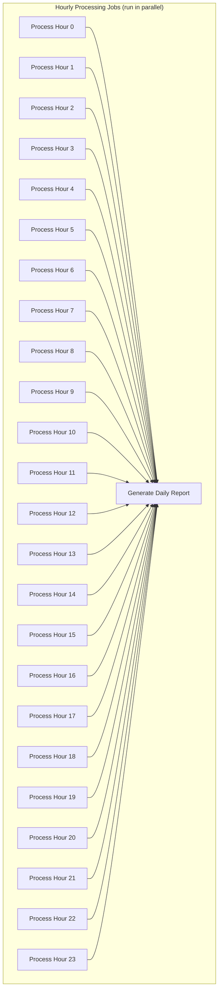

# GitHub Archive Processing Example

This example demonstrates how to use GigQ to process GitHub Archive data. GitHub Archive provides hourly archives of GitHub events, which we'll download, process, and analyze.

## Overview

The workflow will:

1. Download hourly GitHub Archive files for a specific date
2. Process each file to extract repository statistics
3. Generate a daily report summarizing the activity

## Full Code Example

Below is the complete example, which is also available in [`examples/github_archive.py`](https://github.com/gigq/gigq/blob/main/examples/github_archive.py) in the GigQ repository:

```python
"""
Example using GigQ to process GitHub Archive data
"""
import gzip
import json
import logging
import os
import sqlite3
import tempfile
from datetime import datetime, timedelta
from urllib.request import urlretrieve

from gigq import Job, JobQueue, Worker, Workflow

# Configure logging
logging.basicConfig(level=logging.INFO)
logger = logging.getLogger('github_archive_processor')

# SQLite database to store processed data
RESULTS_DB = "github_results.db"

def initialize_results_db():
    """Initialize the results database schema."""
    conn = sqlite3.connect(RESULTS_DB)
    cursor = conn.cursor()

    # Create tables for GitHub events analysis
    cursor.execute('''
    CREATE TABLE IF NOT EXISTS repository_stats (
        date TEXT,
        hour INTEGER,
        repo_name TEXT,
        event_count INTEGER,
        star_count INTEGER,
        fork_count INTEGER,
        watch_count INTEGER,
        PRIMARY KEY (date, hour, repo_name)
    )
    ''')

    cursor.execute('''
    CREATE TABLE IF NOT EXISTS language_stats (
        date TEXT,
        hour INTEGER,
        language TEXT,
        event_count INTEGER,
        repository_count INTEGER,
        PRIMARY KEY (date, hour, language)
    )
    ''')

    conn.commit()
    conn.close()


def download_archive(date, hour):
    """
    Download a GitHub Archive file for the specified date and hour.

    Args:
        date: Date in YYYY-MM-DD format
        hour: Hour (0-23)

    Returns:
        Path to the downloaded file
    """
    # Format the URL
    date_str = date.replace("-", "")
    url = f"https://data.gharchive.org/{date_str}-{hour}.json.gz"

    # Create a temporary file
    temp_file = tempfile.mktemp(suffix=".json.gz")

    logger.info(f"Downloading archive: {url}")
    urlretrieve(url, temp_file)
    logger.info(f"Downloaded to {temp_file}")

    return temp_file


def process_archive(date, hour):
    """
    Process a GitHub Archive file for the specified date and hour.

    Args:
        date: Date in YYYY-MM-DD format
        hour: Hour (0-23)

    Returns:
        Statistics about the processed file
    """
    try:
        # Download the archive
        archive_path = download_archive(date, hour)

        # Initialize counters
        repo_stats = {}  # repo_name -> {events, stars, forks, watches}
        language_stats = {}  # language -> {events, repos}
        total_events = 0
        event_types = {}

        # Process the archive
        logger.info(f"Processing archive for {date} hour {hour}")
        with gzip.open(archive_path, 'rt', encoding='utf-8') as f:
            for line in f:
                # Parse the event
                event = json.loads(line)
                total_events += 1

                # Count event types
                event_type = event.get('type', 'Unknown')
                event_types[event_type] = event_types.get(event_type, 0) + 1

                # Process repository info
                repo = event.get('repo', {})
                repo_name = repo.get('name')
                if repo_name:
                    if repo_name not in repo_stats:
                        repo_stats[repo_name] = {'events': 0, 'stars': 0, 'forks': 0, 'watches': 0}

                    repo_stats[repo_name]['events'] += 1

                    # Process specific event types
                    if event_type == 'WatchEvent':
                        repo_stats[repo_name]['watches'] += 1
                    elif event_type == 'ForkEvent':
                        repo_stats[repo_name]['forks'] += 1
                    elif event_type == 'StarEvent':
                        repo_stats[repo_name]['stars'] += 1

                # Process language info (from payload for PushEvents)
                if event_type == 'PushEvent':
                    payload = event.get('payload', {})
                    commits = payload.get('commits', [])

                    for commit in commits:
                        # In a real implementation, you might need to use GitHub API
                        # to get language info for each repo
                        pass

        # Store results in database
        conn = sqlite3.connect(RESULTS_DB)
        cursor = conn.cursor()

        # Store repository stats
        for repo_name, stats in repo_stats.items():
            cursor.execute(
                '''
                INSERT OR REPLACE INTO repository_stats
                (date, hour, repo_name, event_count, star_count, fork_count, watch_count)
                VALUES (?, ?, ?, ?, ?, ?, ?)
                ''',
                (
                    date, hour, repo_name, stats['events'],
                    stats['stars'], stats['forks'], stats['watches']
                )
            )

        # Store language stats (in a real implementation this would be populated)
        for language, stats in language_stats.items():
            cursor.execute(
                '''
                INSERT OR REPLACE INTO language_stats
                (date, hour, language, event_count, repository_count)
                VALUES (?, ?, ?, ?, ?)
                ''',
                (date, hour, language, stats.get('events', 0), stats.get('repos', 0))
            )

        conn.commit()
        conn.close()

        # Clean up
        os.unlink(archive_path)

        # Return summary
        return {
            'date': date,
            'hour': hour,
            'total_events': total_events,
            'unique_repositories': len(repo_stats),
            'event_types': event_types
        }

    except Exception as e:
        logger.error(f"Error processing archive for {date} hour {hour}: {e}")
        raise


def generate_daily_report(date):
    """
    Generate a summary report for a full day of GitHub activity.

    Args:
        date: Date in YYYY-MM-DD format

    Returns:
        Report statistics
    """
    conn = sqlite3.connect(RESULTS_DB)
    cursor = conn.cursor()

    # Get total events by hour
    cursor.execute(
        '''
        SELECT hour, SUM(event_count) as total
        FROM repository_stats
        WHERE date = ?
        GROUP BY hour
        ORDER BY hour
        ''',
        (date,)
    )
    hourly_events = {row[0]: row[1] for row in cursor.fetchall()}

    # Get top repositories by events
    cursor.execute(
        '''
        SELECT repo_name, SUM(event_count) as total
        FROM repository_stats
        WHERE date = ?
        GROUP BY repo_name
        ORDER BY total DESC
        LIMIT 10
        ''',
        (date,)
    )
    top_repos = [(row[0], row[1]) for row in cursor.fetchall()]

    # Get top repositories by stars
    cursor.execute(
        '''
        SELECT repo_name, SUM(star_count) as total
        FROM repository_stats
        WHERE date = ?
        GROUP BY repo_name
        ORDER BY total DESC
        LIMIT 10
        ''',
        (date,)
    )
    top_starred = [(row[0], row[1]) for row in cursor.fetchall()]

    conn.close()

    # Generate report
    report = {
        'date': date,
        'total_events': sum(hourly_events.values()),
        'hourly_events': hourly_events,
        'top_repositories': top_repos,
        'top_starred': top_starred
    }

    logger.info(f"Generated report for {date}")
    logger.info(f"Total events: {report['total_events']}")

    return report


def build_github_archive_workflow(date):
    """
    Build a workflow for processing GitHub Archive data for a specific date.

    Args:
        date: Date in YYYY-MM-DD format

    Returns:
        A Workflow object
    """
    # Ensure the results database is initialized
    initialize_results_db()

    # Create a workflow
    workflow = Workflow(f"github_archive_{date}")

    # Add jobs for each hour of the day
    hour_jobs = []
    for hour in range(24):
        job = Job(
            name=f"process_{date}_{hour}",
            function=process_archive,
            params={'date': date, 'hour': hour},
            max_attempts=3,
            timeout=600,  # 10 minutes
            description=f"Process GitHub Archive for {date} hour {hour}"
        )
        workflow.add_job(job)
        hour_jobs.append(job)

    # Add a final job to generate a daily report, dependent on all hourly jobs
    report_job = Job(
        name=f"report_{date}",
        function=generate_daily_report,
        params={'date': date},
        max_attempts=2,
        timeout=300,  # 5 minutes
        description=f"Generate daily report for {date}"
    )
    workflow.add_job(report_job, depends_on=hour_jobs)

    return workflow


if __name__ == "__main__":
    # Example usage
    import sys

    if len(sys.argv) < 2:
        print("Usage: python github_archive_example.py YYYY-MM-DD")
        sys.exit(1)

    date = sys.argv[1]

    # Create the job queue
    queue = JobQueue("github_jobs.db")

    # Build and submit the workflow
    workflow = build_github_archive_workflow(date)
    job_ids = workflow.submit_all(queue)

    print(f"Submitted workflow with {len(job_ids)} jobs")

    # Start a worker if requested
    if "--worker" in sys.argv:
        worker = Worker("github_jobs.db")
        print("Starting worker...")
        worker.start()
```

## Step-by-Step Explanation

Let's break down how this example uses GigQ to process GitHub Archive data.

### 1. Database Setup

First, we initialize a SQLite database to store the processed results:

```python
def initialize_results_db():
    conn = sqlite3.connect(RESULTS_DB)
    cursor = conn.cursor()

    # Create tables for GitHub events analysis
    cursor.execute('''
    CREATE TABLE IF NOT EXISTS repository_stats (
        date TEXT,
        hour INTEGER,
        repo_name TEXT,
        event_count INTEGER,
        star_count INTEGER,
        fork_count INTEGER,
        watch_count INTEGER,
        PRIMARY KEY (date, hour, repo_name)
    )
    ''')

    # ... (another table for language stats)

    conn.commit()
    conn.close()
```

### 2. Job Functions

We define three main functions that will be executed as jobs:

1. `download_archive(date, hour)` - Downloads a GitHub Archive file for a specific date and hour
2. `process_archive(date, hour)` - Processes the archive and stores results in the database
3. `generate_daily_report(date)` - Generates a summary report from the processed data

### 3. Building the Workflow

The `build_github_archive_workflow` function creates a workflow with 25 jobs:

```python
def build_github_archive_workflow(date):
    # Ensure the results database is initialized
    initialize_results_db()

    # Create a workflow
    workflow = Workflow(f"github_archive_{date}")

    # Add jobs for each hour of the day (24 jobs)
    hour_jobs = []
    for hour in range(24):
        job = Job(
            name=f"process_{date}_{hour}",
            function=process_archive,
            params={'date': date, 'hour': hour},
            max_attempts=3,
            timeout=600,  # 10 minutes
            description=f"Process GitHub Archive for {date} hour {hour}"
        )
        workflow.add_job(job)
        hour_jobs.append(job)

    # Add a final job to generate a daily report (1 job)
    report_job = Job(
        name=f"report_{date}",
        function=generate_daily_report,
        params={'date': date},
        max_attempts=2,
        timeout=300,  # 5 minutes
        description=f"Generate daily report for {date}"
    )
    workflow.add_job(report_job, depends_on=hour_jobs)

    return workflow
```

This creates a workflow with:

- 24 independent jobs (one for each hour) that can run in parallel
- 1 final job that depends on all 24 hourly jobs to complete

### 4. Submitting and Running the Workflow

Finally, we create a job queue, submit the workflow, and optionally start a worker:

```python
if __name__ == "__main__":
    # ... (parse command line arguments)

    # Create the job queue
    queue = JobQueue("github_jobs.db")

    # Build and submit the workflow
    workflow = build_github_archive_workflow(date)
    job_ids = workflow.submit_all(queue)

    print(f"Submitted workflow with {len(job_ids)} jobs")

    # Start a worker if requested
    if "--worker" in sys.argv:
        worker = Worker("github_jobs.db")
        print("Starting worker...")
        worker.start()
```

## Workflow Visualization

Here's a visual representation of the workflow:



## Running the Example

To run this example:

```bash
# Install GigQ if you haven't already
pip install gigq

# Run the example for a specific date
python github_archive.py 2023-01-01

# Run the example and also start a worker
python github_archive.py 2023-01-01 --worker

# Or start workers separately for parallel processing
gigq --db github_jobs.db worker
```

## Monitoring Progress

You can monitor the progress of the workflow using the GigQ CLI:

```bash
# List all jobs
gigq --db github_jobs.db list

# List pending jobs
gigq --db github_jobs.db list --status pending

# List completed jobs
gigq --db github_jobs.db list --status completed

# Check the status of the report job
gigq --db github_jobs.db status JOB_ID --show-result
```

## Extensions and Improvements

This example demonstrates the basic functionality of GigQ for processing GitHub Archive data. Some possible extensions include:

1. **Multiple Workers**: Run multiple workers in parallel to process the hourly data faster:

   ```bash
   # Run 4 workers in separate terminals or processes
   gigq --db github_jobs.db worker
   ```

2. **Error Handling**: Improve error handling with custom retry logic:

   ```python
   def process_archive_with_retry(date, hour, retry_delay=60):
       try:
           return process_archive(date, hour)
       except Exception as e:
           if "Rate limit exceeded" in str(e):
               logger.warning(f"Rate limit exceeded, sleeping for {retry_delay} seconds")
               time.sleep(retry_delay)
               return process_archive(date, hour)
           raise
   ```

3. **Date Range Processing**: Extend the example to process a range of dates:
   ```python
   def process_date_range(start_date, end_date):
       current_date = datetime.strptime(start_date, "%Y-%m-%d")
       end = datetime.strptime(end_date, "%Y-%m-%d")

       while current_date <= end:
           date_str = current_date.strftime("%Y-%m-%d")
           workflow = build_github_archive_workflow(date_str)
           workflow.submit_all(queue)
           current_date += timedelta(days=1)
   ```

## Next Steps

Now that you've seen a practical example of using GigQ, you might want to explore:

- [Workflows](../user-guide/workflows.md) - Learn more about creating complex workflows
- [Workers](../user-guide/workers.md) - Understand how workers process jobs
- [Error Handling](../user-guide/error-handling.md) - Learn about GigQ's error handling capabilities
