# Scheduled Background Tasks Example

This example demonstrates how to use GigQ with a scheduler to run recurring background tasks. While GigQ doesn't have built-in scheduling, it works well with external schedulers.

## Overview

This example shows how to:

1. Create a scheduler daemon that submits jobs to GigQ at specific times
2. Run different types of scheduled tasks (hourly, daily, weekly)
3. Handle dependencies between scheduled tasks
4. Manage the lifecycle of recurring jobs

## Complete Example

Here's the full code example of a scheduler for GigQ:

```python
"""
Example of using GigQ with a scheduler for recurring tasks.
"""
import os
import time
import signal
import logging
import schedule
import datetime
import sqlite3
from gigq import Job, JobQueue, Worker, Workflow

# Configure logging
logging.basicConfig(
    level=logging.INFO,
    format='%(asctime)s - %(name)s - %(levelname)s - %(message)s'
)
logger = logging.getLogger('gigq_scheduler')

# Global variables
running = True
queue = JobQueue("scheduled_jobs.db")

# Example job functions
def hourly_data_sync(source, destination):
    """Sync data from source to destination."""
    logger.info(f"Syncing data from {source} to {destination}")
    # Simulate work
    time.sleep(5)
    return {
        "source": source,
        "destination": destination,
        "records_synced": 100,
        "timestamp": datetime.datetime.now().isoformat()
    }

def daily_report_generation(data_dir, output_file):
    """Generate a daily report."""
    logger.info(f"Generating daily report from {data_dir} to {output_file}")
    # Simulate work
    time.sleep(10)

    # Create output directory if needed
    os.makedirs(os.path.dirname(output_file), exist_ok=True)

    # Write a simple report
    with open(output_file, 'w') as f:
        f.write(f"Daily Report - Generated at {datetime.datetime.now().isoformat()}\n")
        f.write(f"Data source: {data_dir}\n")
        f.write("Summary:\n")
        f.write("- 100 records processed\n")
        f.write("- 5 errors detected\n")
        f.write("- 95% success rate\n")

    return {
        "data_dir": data_dir,
        "output_file": output_file,
        "records_processed": 100,
        "timestamp": datetime.datetime.now().isoformat()
    }

def weekly_cleanup(data_dir, days_to_keep=7):
    """Clean up old files and data."""
    logger.info(f"Cleaning up files older than {days_to_keep} days in {data_dir}")

    # Simulate work
    time.sleep(8)

    # Get current time for comparison
    now = datetime.datetime.now()
    cutoff = now - datetime.timedelta(days=days_to_keep)
    cutoff_str = cutoff.isoformat()

    return {
        "data_dir": data_dir,
        "days_kept": days_to_keep,
        "files_removed": 25,
        "space_freed_mb": 150,
        "cutoff_date": cutoff_str,
        "timestamp": now.isoformat()
    }

def error_notification(error_data, recipients):
    """Send error notifications."""
    logger.info(f"Sending error notification to {recipients}")
    # Simulate sending an email
    time.sleep(2)
    return {
        "recipients": recipients,
        "errors_reported": len(error_data),
        "timestamp": datetime.datetime.now().isoformat()
    }

# Scheduler functions
def schedule_hourly_sync():
    """Schedule the hourly data sync job."""
    logger.info("Scheduling hourly data sync")

    # Create the job
    job = Job(
        name=f"hourly_sync_{datetime.datetime.now().strftime('%Y%m%d_%H%M')}",
        function=hourly_data_sync,
        params={
            "source": "database_a",
            "destination": "database_b"
        },
        max_attempts=3,
        timeout=300,  # 5 minutes
        description="Hourly data synchronization"
    )

    # Submit the job
    job_id = queue.submit(job)
    logger.info(f"Submitted hourly sync job: {job_id}")
    return job_id

def schedule_daily_report():
    """Schedule the daily report generation job."""
    logger.info("Scheduling daily report generation")

    today = datetime.datetime.now().strftime("%Y-%m-%d")
    output_file = f"reports/daily/report_{today}.txt"

    # Create the job
    job = Job(
        name=f"daily_report_{today}",
        function=daily_report_generation,
        params={
            "data_dir": "data/daily",
            "output_file": output_file
        },
        max_attempts=2,
        timeout=600,  # 10 minutes
        description=f"Daily report generation for {today}"
    )

    # Submit the job
    job_id = queue.submit(job)
    logger.info(f"Submitted daily report job: {job_id}")
    return job_id

def schedule_weekly_cleanup():
    """Schedule the weekly cleanup job."""
    logger.info("Scheduling weekly cleanup")

    # Create the job
    job = Job(
        name=f"weekly_cleanup_{datetime.datetime.now().strftime('%Y%m%d')}",
        function=weekly_cleanup,
        params={
            "data_dir": "data/",
            "days_to_keep": 30
        },
        max_attempts=2,
        timeout=1800,  # 30 minutes
        description="Weekly data cleanup"
    )

    # Submit the job
    job_id = queue.submit(job)
    logger.info(f"Submitted weekly cleanup job: {job_id}")
    return job_id

def schedule_dependent_tasks():
    """Schedule a series of dependent tasks."""
    logger.info("Scheduling dependent tasks")

    # Create a workflow
    workflow = Workflow("daily_processing")

    # Define the jobs
    sync_job = Job(
        name=f"data_sync_{datetime.datetime.now().strftime('%Y%m%d')}",
        function=hourly_data_sync,
        params={
            "source": "main_database",
            "destination": "reporting_database"
        },
        max_attempts=3,
        timeout=300
    )

    report_job = Job(
        name=f"main_report_{datetime.datetime.now().strftime('%Y%m%d')}",
        function=daily_report_generation,
        params={
            "data_dir": "data/main",
            "output_file": f"reports/main/report_{datetime.datetime.now().strftime('%Y-%m-%d')}.txt"
        },
        max_attempts=2,
        timeout=600
    )

    # Define error handling job - this is a contingency job that only runs if needed
    error_job = Job(
        name=f"error_notification_{datetime.datetime.now().strftime('%Y%m%d')}",
        function=error_notification,
        params={
            "error_data": [{"severity": "high", "message": "Report generation failed"}],
            "recipients": ["admin@example.com"]
        },
        max_attempts=5,
        timeout=180
    )

    # Add jobs to the workflow with dependencies
    workflow.add_job(sync_job)
    workflow.add_job(report_job, depends_on=[sync_job])

    # Submit the workflow
    job_ids = workflow.submit_all(queue)
    logger.info(f"Submitted workflow with {len(job_ids)} jobs")

    return job_ids

def monitor_job_status():
    """Monitor the status of scheduled jobs."""
    # Get all jobs from the last 24 hours
    yesterday = (datetime.datetime.now() - datetime.timedelta(days=1)).isoformat()

    conn = sqlite3.connect(queue.db_path)
    cursor = conn.execute(
        "SELECT id, name, status, created_at FROM jobs WHERE created_at > ?",
        (yesterday,)
    )

    jobs = cursor.fetchall()
    conn.close()

    # Count by status
    status_counts = {}
    for job in jobs:
        status = job[2]
        if status not in status_counts:
            status_counts[status] = 0
        status_counts[status] += 1

    logger.info(f"Job status in the last 24 hours: {status_counts}")

    # Check for failed jobs
    failed_jobs = [job for job in jobs if job[2] == 'failed']
    if failed_jobs:
        logger.warning(f"Found {len(failed_jobs)} failed jobs")
        for job in failed_jobs:
            logger.warning(f"Failed job: {job[1]} (ID: {job[0]}) created at {job[3]}")

            # Get failure details
            status = queue.get_status(job[0])
            if status.get('error'):
                logger.warning(f"Error: {status['error']}")

            # Maybe requeue important jobs that have failed
            if "critical" in job[1].lower():
                if queue.requeue_job(job[0]):
                    logger.info(f"Requeued critical job: {job[0]}")

# Main scheduler function
def run_scheduler():
    """Run the scheduler."""
    logger.info("Starting GigQ scheduler")

    # Schedule hourly tasks
    schedule.every().hour.at(":00").do(schedule_hourly_sync)

    # Schedule daily tasks
    schedule.every().day.at("01:00").do(schedule_daily_report)

    # Schedule weekly tasks
    schedule.every().monday.at("02:00").do(schedule_weekly_cleanup)

    # Schedule dependent tasks
    schedule.every().day.at("04:00").do(schedule_dependent_tasks)

    # Monitor job status periodically
    schedule.every(30).minutes.do(monitor_job_status)

    # Signal handler for graceful shutdown
    def handle_signal(sig, frame):
        global running
        logger.info(f"Received signal {sig}, shutting down scheduler...")
        running = False

    signal.signal(signal.SIGINT, handle_signal)
    signal.signal(signal.SIGTERM, handle_signal)

    # Run the scheduler loop
    while running:
        schedule.run_pending()
        time.sleep(1)

    logger.info("Scheduler stopped")

if __name__ == "__main__":
    import argparse

    parser = argparse.ArgumentParser(description="GigQ Scheduler")
    parser.add_argument("--run-now", action="store_true", help="Run scheduled jobs immediately")
    parser.add_argument("--worker", action="store_true", help="Start a worker after scheduling jobs")
    args = parser.parse_args()

    # Run jobs immediately if requested
    if args.run_now:
        logger.info("Running scheduled jobs immediately")
        schedule_hourly_sync()
        schedule_daily_report()
        schedule_weekly_cleanup()
        schedule_dependent_tasks()

    # Start the scheduler
    if args.worker:
        # Start both a scheduler and a worker
        import threading

        # Start the scheduler in a separate thread
        scheduler_thread = threading.Thread(target=run_scheduler)
        scheduler_thread.daemon = True
        scheduler_thread.start()

        # Start a worker in the main thread
        logger.info("Starting worker")
        worker = Worker("scheduled_jobs.db")
        worker.start()
    else:
        # Just run the scheduler
        run_scheduler()
```

## Running the Example

To run this example:

```bash
# Install required dependencies
pip install gigq schedule

# Run just the scheduler
python scheduled_tasks.py

# Run the scheduler and immediately schedule jobs
python scheduled_tasks.py --run-now

# Run both the scheduler and a worker
python scheduled_tasks.py --worker

# Run separate workers (in separate terminals)
gigq --db scheduled_jobs.db worker
```

## Scheduling Patterns Demonstrated

This example demonstrates several common scheduling patterns:

1. **Simple Recurring Jobs**: Basic tasks that run at regular intervals (hourly sync)
2. **Time-of-Day Jobs**: Tasks that run at specific times (daily report at 1:00 AM)
3. **Day-of-Week Jobs**: Tasks that run on specific days (weekly cleanup on Mondays)
4. **Dependent Job Chains**: Series of tasks where each depends on the previous one
5. **Monitoring Jobs**: Tasks that monitor and manage other jobs

## Scheduler Visualization

Here's a visual representation of when tasks run:

```mermaid
gantt
    title Scheduled Tasks
    dateFormat  HH:mm
    axisFormat %H:%M

    section Hourly
    Data Sync           :crit, sync, 00:00, 1h
    Data Sync           :crit, sync, 01:00, 1h
    Data Sync           :crit, sync, 02:00, 1h
    Data Sync           :crit, sync, 03:00, 1h

    section Daily
    Daily Report        :report, 01:00, 30m
    Dependent Tasks     :depends, 04:00, 1h

    section Weekly
    Weekly Cleanup      :cleanup, 02:00, 1h

    section Monitoring
    Monitor Jobs        :monitor, 00:00, 15m
    Monitor Jobs        :monitor, 00:30, 15m
    Monitor Jobs        :monitor, 01:00, 15m
    Monitor Jobs        :monitor, 01:30, 15m
```



## Key Features Demonstrated

This example demonstrates several important features:

1. **Task Scheduling**: Using the `schedule` library to trigger jobs at specific times
2. **Job Independence**: Each scheduled task runs independently
3. **Dependent Jobs**: Tasks that depend on other tasks (using workflows)
4. **Job Monitoring**: Checking job status and handling failures
5. **Parameterized Jobs**: Passing different parameters to jobs based on runtime conditions
6. **Graceful Shutdown**: Handling signals for clean application termination

## Configuration Options

The scheduler in this example can be configured in various ways:

1. **Schedule Times**: Modify the schedule times in `run_scheduler` to suit your needs
2. **Job Parameters**: Change job parameters in the scheduling functions
3. **Retry Logic**: Adjust `max_attempts` and `timeout` values for each job
4. **Monitoring Frequency**: Change how often job monitoring runs

## Deployment Considerations

When deploying this scheduler in production:

1. **Process Monitoring**: Use a process manager like Supervisor, systemd, or PM2 to ensure the scheduler stays running
2. **Logging**: Configure proper logging to files with rotation
3. **Separate Workers**: Run workers as separate processes to handle the jobs
4. **Error Notifications**: Implement proper error notifications via email, Slack, etc.
5. **Database Backups**: Regularly backup the SQLite database

Example systemd service file for the scheduler:

```ini
[Unit]
Description=GigQ Scheduler
After=network.target

[Service]
User=appuser
WorkingDirectory=/path/to/app
ExecStart=/path/to/python /path/to/app/scheduled_tasks.py
Restart=always
RestartSec=10

[Install]
WantedBy=multi-user.target
```

## Alternative Scheduling Approaches

Besides using the `schedule` library, you can also schedule GigQ jobs with:

1. **Cron Jobs**: Use system cron to run scripts that submit jobs to GigQ

   ```bash
   # /etc/crontab entry
   0 1 * * * appuser /path/to/python /path/to/submit_daily_report.py
   ```

2. **APScheduler**: Use the more powerful APScheduler library instead of `schedule`

   ```python
   from apscheduler.schedulers.blocking import BlockingScheduler

   scheduler = BlockingScheduler()
   scheduler.add_job(schedule_daily_report, 'cron', hour=1)
   scheduler.start()
   ```

3. **Celery Beat**: If you're already using Celery, you can use Celery Beat to schedule GigQ job submissions

## Next Steps

Now that you've seen how to schedule recurring tasks with GigQ, you might want to explore:

- [Data Processing Example](data-processing.md) - Learn how to build data processing pipelines
- [GitHub Archive Example](github-archive.md) - See another example application
- [Workflows](../user-guide/workflows.md) - Learn more about creating complex workflows
- [Job Queue Management](../user-guide/job-queue.md) - Advanced job queue management techniques
