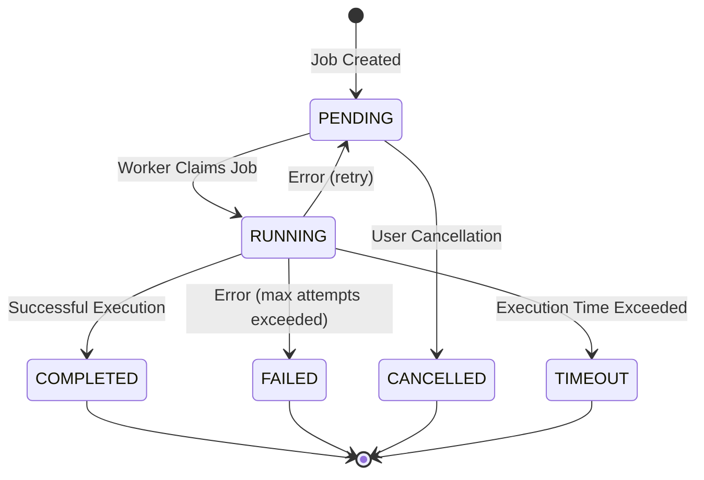
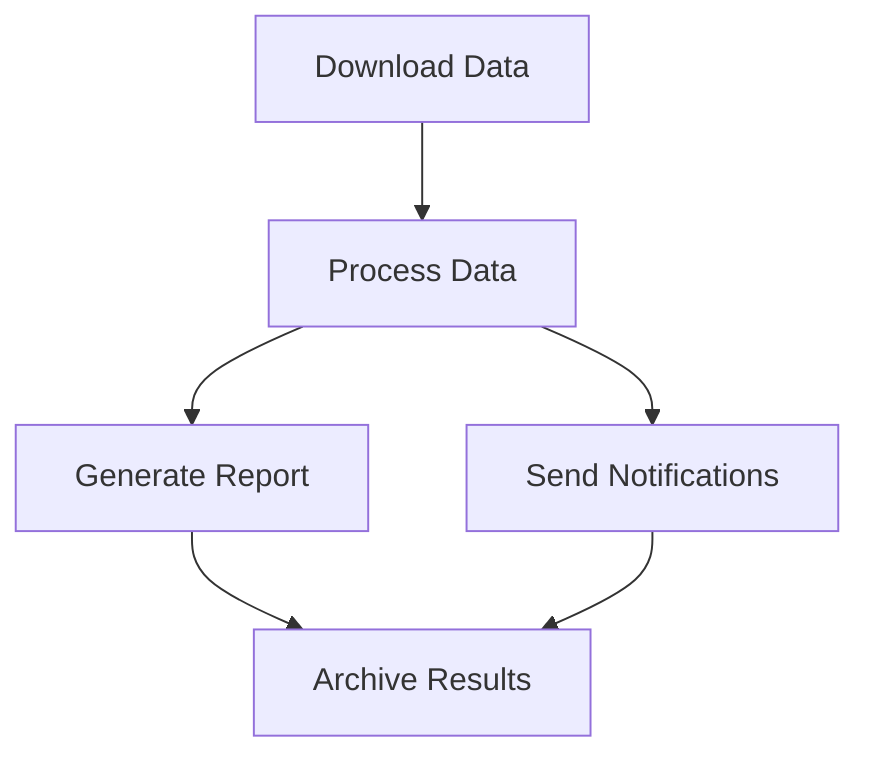

# Core Concepts

This page introduces the key concepts and components of GigQ.

## Overview

GigQ is centered around a few simple concepts:

1. **Jobs** - Units of work to be executed
2. **Job Queue** - Manages the storage and retrieval of jobs
3. **Workers** - Execute jobs from the queue
4. **Workflows** - Define dependencies between jobs

Let's explore each of these components in detail.

## Jobs

A **Job** represents a unit of work to be executed. It encapsulates:

- A function to execute
- Parameters to pass to the function
- Execution settings (e.g., timeout, retry policy)
- Metadata (e.g., name, description)

### Job States

A job can be in one of several states:



- **PENDING** - The job is waiting to be executed
- **RUNNING** - The job is currently being executed by a worker
- **COMPLETED** - The job has successfully completed
- **FAILED** - The job has failed after exhausting all retry attempts
- **CANCELLED** - The job was cancelled by the user
- **TIMEOUT** - The job execution exceeded the timeout

### Job Attributes

A job has the following attributes:

| Attribute      | Description                                             |
| -------------- | ------------------------------------------------------- |
| `id`           | Unique identifier (auto-generated UUID)                 |
| `name`         | Human-readable name                                     |
| `function`     | The function to execute                                 |
| `params`       | Dictionary of parameters to pass to the function        |
| `priority`     | Execution priority (higher values execute first)        |
| `dependencies` | List of job IDs that must complete before this job runs |
| `max_attempts` | Maximum number of retry attempts                        |
| `timeout`      | Maximum execution time in seconds                       |
| `description`  | Optional description                                    |

## Job Queue

The **JobQueue** manages the storage and retrieval of jobs. It:

- Stores jobs in a SQLite database
- Ensures atomic operations for job state transitions
- Manages job prioritization and dependency resolution
- Provides interfaces for job submission, cancellation, and status queries

The job queue is backed by a SQLite database, making it:

- Simple to set up (no external dependencies)
- Reliable (SQLite's ACID guarantees)
- Portable (single file database)
- Suitable for most local/small-scale job processing needs

## Workers

A **Worker** processes jobs from the queue. It:

- Claims jobs from the queue
- Executes the job functions
- Updates job states based on execution results
- Handles retries for failed jobs
- Detects and recovers from timeouts

Workers can run:

- In the same process as the job submitter
- In separate processes
- On different machines (as long as they can access the same database file)

Multiple workers can process jobs concurrently, with SQLite's locking mechanisms ensuring that each job is processed exactly once.

## Workflows

A **Workflow** defines a series of related jobs with dependencies. It:

- Groups jobs together under a common name
- Defines execution order through job dependencies
- Simplifies the management of complex multi-step processes

Workflows are particularly useful for:

- ETL pipelines
- Data processing tasks with multiple stages
- Any process that requires multiple dependent steps

### Workflow Example

Here's how a simple workflow might look:



In GigQ, this would be defined as:

```python
workflow = Workflow("data_pipeline")

download_job = Job(name="download", function=download_data)
process_job = Job(name="process", function=process_data)
report_job = Job(name="report", function=generate_report)
notify_job = Job(name="notify", function=send_notifications)
archive_job = Job(name="archive", function=archive_results)

workflow.add_job(download_job)
workflow.add_job(process_job, depends_on=[download_job])
workflow.add_job(report_job, depends_on=[process_job])
workflow.add_job(notify_job, depends_on=[process_job])
workflow.add_job(archive_job, depends_on=[report_job, notify_job])

workflow.submit_all(queue)
```

## SQLite Storage

GigQ uses SQLite as its storage backend, with two main tables:

1. **jobs** - Stores job definitions and current state
2. **job_executions** - Tracks individual execution attempts

The SQLite backend provides:

- **Simplicity** - No need to set up external services
- **Reliability** - ACID transactions ensure consistency
- **Portability** - Single file database, easy to backup and manage
- **Concurrency** - Built-in locking mechanisms for safe multi-worker operation

## Next Steps

Now that you understand the core concepts, learn more about:

- [Defining Jobs](../user-guide/defining-jobs.md) - How to create and configure jobs
- [Job Queue](../user-guide/job-queue.md) - How to manage jobs in the queue
- [Workers](../user-guide/workers.md) - How to process jobs
- [Workflows](../user-guide/workflows.md) - How to create and manage workflows
