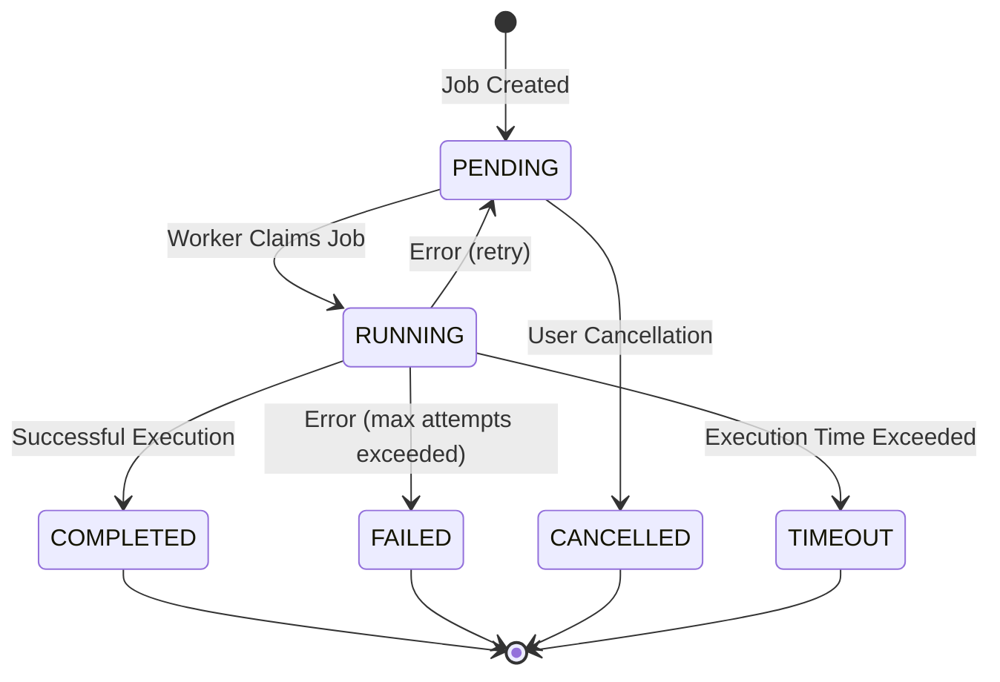

# GigQ: Lightweight Local Job Queue

<div class="grid cards" markdown>

- :material-bolt-circle: **Simple by Design**

  ***

  Define, queue, and process jobs with minimal setup and configuration

- :material-database-lock: **SQLite Powered**

  ***

  Built on SQLite for reliability and simplicity with no extra dependencies

- :material-file-tree: **Workflow Support**

  ***

  Create complex job workflows with dependencies and prioritization

- :material-scale-balance: **Lightweight Concurrency**

  ***

  Process jobs in parallel with built-in locking and state management

</div>

## What is GigQ?

GigQ is a lightweight job queue system with SQLite as its backend. It's designed for managing and executing small jobs ("gigs") locally with atomicity guarantees, particularly suited for processing tasks like data transformations, API calls, or batch operations, without the complexity of distributed job systems.

```python
from gigq import Job, JobQueue, Worker

# Define a job function
def process_data(filename, threshold=0.5):
    # Process some data
    print(f"Processing {filename} with threshold {threshold}")
    return {"processed": True, "count": 42}

# Submit a job
queue = JobQueue("jobs.db")
job_id = queue.submit(Job(
    name="process_data_job",
    function=process_data,
    params={"filename": "data.csv", "threshold": 0.7}
))

# Start a worker to process jobs
worker = Worker("jobs.db")
worker.start()
```

## Why GigQ?

GigQ fills the gap between complex distributed job queues (like Celery or RQ) and simple task schedulers. It provides a balance of features and simplicity that's perfect for:

- **Local data processing** - Process files, transform data, and generate reports
- **Task automation** - Run scheduled tasks with dependencies and error handling
- **API request batching** - Queue and process API requests with rate limiting
- **Workflow orchestration** - Build simple workflows with dependencies and state management

All without the overhead of setting up Redis, RabbitMQ, or other external services.

## Key Features

- **Simple job definition and management**
- **SQLite state storage with atomic transactions**
- **Lightweight concurrency with built-in locking**
- **Job recovery and error handling**
- **Command line interface for job management**
- **Workflow support with dependencies**

## Job Lifecycle



## Installation

```bash
pip install gigq
```

## Quick Start

Check out the [Quick Start Guide](getting-started/quick-start.md) to begin using GigQ in your projects.

## License

GigQ is released under the MIT License. See [LICENSE](https://github.com/gigq/gigq/blob/main/LICENSE) for details.
