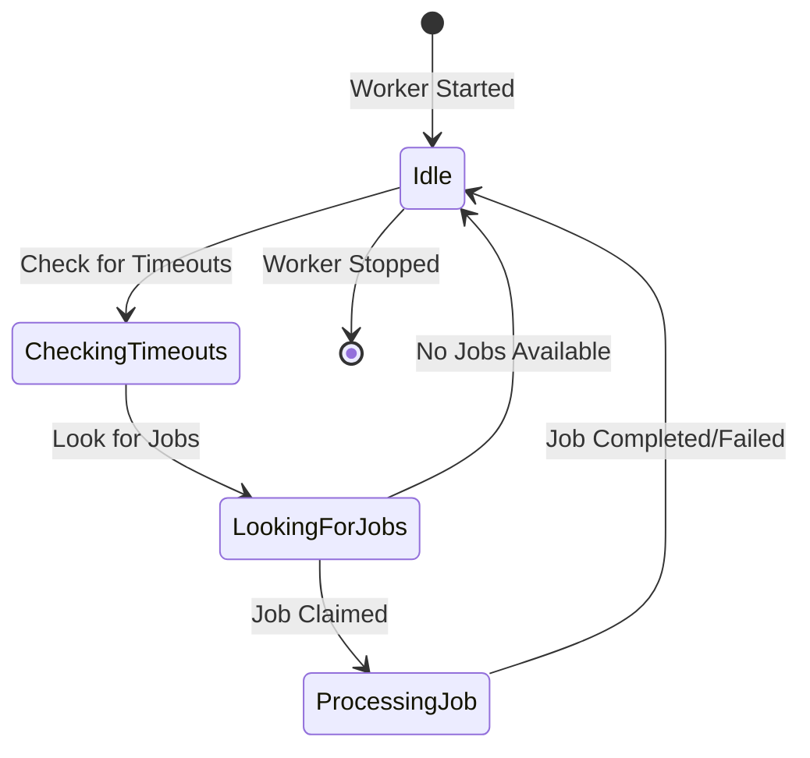

# Workers

Workers are responsible for executing jobs from the queue. This guide explains how to create, configure, and manage workers in GigQ.

## Creating a Worker

To create a worker, instantiate the `Worker` class with a path to the job queue database:

```python
from gigq import Worker

# Create a worker
worker = Worker("jobs.db")
```

By default, the worker will be assigned a unique ID. You can specify a custom ID if needed:

```python
# Create a worker with a custom ID
worker = Worker("jobs.db", worker_id="worker-1")
```

## Starting a Worker

Once you've created a worker, you can start it:

```python
# Start the worker (blocks until the worker is stopped)
worker.start()
```

The `start` method blocks until the worker is stopped, typically by a keyboard interrupt (Ctrl+C) or a signal.

To run the worker in the background, you can use a separate thread or process:

```python
import threading

# Start the worker in a background thread
worker_thread = threading.Thread(target=worker.start)
worker_thread.daemon = True  # Thread will exit when the main program exits
worker_thread.start()

# Continue with other tasks...
```

## Processing a Single Job

If you want to process just one job and then stop:

```python
# Process a single job
result = worker.process_one()

if result:
    print("Processed one job")
else:
    print("No jobs available to process")
```

The `process_one` method returns `True` if a job was processed, or `False` if no jobs were available.

## Stopping a Worker

To stop a running worker:

```python
# Stop the worker
worker.stop()
```

This will cause the worker to exit its processing loop after completing its current job (if any).

Workers also handle signals automatically. When a worker receives a `SIGINT` (Ctrl+C) or `SIGTERM` signal, it will stop gracefully.

## Worker Configuration

The `Worker` class accepts several parameters to customize its behavior:

| Parameter          | Type | Default        | Description                                  |
| ------------------ | ---- | -------------- | -------------------------------------------- |
| `db_path`          | str  |                | Path to the SQLite database file (required)  |
| `worker_id`        | str  | auto-generated | Unique identifier for the worker             |
| `polling_interval` | int  | 5              | How often to check for new jobs (in seconds) |

Example with custom configuration:

```python
# Create a worker with custom parameters
worker = Worker(
    "jobs.db",
    worker_id="worker-batch-processor",
    polling_interval=2  # Check for new jobs every 2 seconds
)
```

## How Workers Process Jobs

When a worker runs, it follows this process:

1. Check for timed out jobs and handle them
2. Try to claim a job from the queue
3. If a job is claimed, execute its function
4. Update the job status based on the execution result
5. If no job is claimed, wait for the polling interval
6. Repeat until stopped

This loop ensures that jobs are processed efficiently while minimizing database load during idle periods.

## Job Execution Process

When a worker executes a job, it follows these steps:

1. **Claim the job**: Mark the job as running and increment its attempt counter
2. **Import the function**: Dynamically import the function from its module
3. **Execute the function**: Call the function with the job's parameters
4. **Record the result**: Store the function's return value or error message
5. **Update the job status**: Mark the job as completed, failed, or pending (for retry)

If the function raises an exception, the worker will:

- Log the error
- Determine if the job should be retried based on `max_attempts`
- Update the job status accordingly

## Running Multiple Workers

You can run multiple workers simultaneously to process jobs in parallel:

```python
# In worker_script.py
from gigq import Worker
import sys

worker_id = sys.argv[1] if len(sys.argv) > 1 else None
worker = Worker("jobs.db", worker_id=worker_id)
worker.start()
```

Then run multiple instances:

```bash
# Run 3 workers
python worker_script.py worker-1 &
python worker_script.py worker-2 &
python worker_script.py worker-3 &
```

Each worker will claim and process jobs independently, with SQLite's locking mechanisms ensuring that each job is processed exactly once.

## Worker Concurrency

GigQ uses SQLite's locking mechanisms to ensure safe concurrency:

1. Workers claim jobs using an exclusive transaction
2. Only one worker can claim a particular job
3. If multiple workers try to claim the same job, only one will succeed

This approach provides robust concurrency without requiring complex distributed locking mechanisms.

## Handling Worker Crashes

If a worker crashes while processing a job, the job remains in the "running" state. GigQ handles this through timeout detection:

1. When a worker starts, it checks for jobs that have been running longer than their timeout
2. If it finds timed out jobs, it marks them as timed out or requeues them for retry
3. This ensures that jobs don't get stuck in the running state if a worker crashes

## Worker Lifecycle

A typical worker lifecycle looks like this:



## Monitoring Workers

You can monitor worker activity through the job queue:

```python
from gigq import JobQueue, JobStatus

queue = JobQueue("jobs.db")

# Get all running jobs
running_jobs = queue.list_jobs(status=JobStatus.RUNNING)

# Group by worker
workers = {}
for job in running_jobs:
    worker_id = job.get('worker_id')
    if worker_id:
        if worker_id not in workers:
            workers[worker_id] = []
        workers[worker_id].append(job)

# Print worker activity
for worker_id, jobs in workers.items():
    print(f"Worker {worker_id} is processing {len(jobs)} jobs:")
    for job in jobs:
        print(f"  - {job['name']} (started at {job['started_at']})")
```

## Worker Best Practices

1. **Use appropriate polling intervals**: Lower values increase responsiveness but also database load.

2. **Set reasonable job timeouts**: Ensure timeouts are long enough for normal execution but short enough to detect hung jobs.

3. **Handle signals**: Make sure your application handles SIGINT and SIGTERM properly to allow workers to shut down gracefully.

4. **Monitor worker health**: Set up monitoring to restart workers if they crash or become unresponsive.

5. **Scale appropriately**: Use enough workers to process your workload efficiently, but not so many that they overwhelm your system or database.

6. **Consider worker specialization**: You can run different workers for different types of jobs by using separate queue databases.

7. **Log worker activity**: Enable logging to track worker behavior and troubleshoot issues.

## Example: Background Processing Service

Here's an example of a background processing service that runs multiple workers:

```python
"""
Background processing service for GigQ.
"""
import argparse
import logging
import os
import signal
import sys
import time
from multiprocessing import Process

from gigq import Worker, JobQueue

# Configure logging
logging.basicConfig(
    level=logging.INFO,
    format='%(asctime)s - %(name)s - %(levelname)s - %(message)s'
)
logger = logging.getLogger('background_service')

def run_worker(db_path, worker_id):
    """Run a worker process."""
    worker = Worker(db_path, worker_id=worker_id)
    logger.info(f"Starting worker {worker_id}")
    worker.start()
    logger.info(f"Worker {worker_id} stopped")

def main():
    parser = argparse.ArgumentParser(description="GigQ Background Processing Service")
    parser.add_argument("--db", default="jobs.db", help="Path to job queue database")
    parser.add_argument("--workers", type=int, default=2, help="Number of worker processes")
    parser.add_argument("--check-interval", type=int, default=60,
                        help="Interval (in seconds) to check for stalled jobs")
    args = parser.parse_args()

    logger.info(f"Starting background service with {args.workers} workers")

    # Create worker processes
    processes = []
    for i in range(args.workers):
        worker_id = f"worker-{i+1}"
        p = Process(target=run_worker, args=(args.db, worker_id))
        p.start()
        processes.append((p, worker_id))
        logger.info(f"Started worker process {worker_id} (PID: {p.pid})")

    # Set up signal handlers
    def handle_signal(sig, frame):
        logger.info(f"Received signal {sig}, shutting down...")
        for p, worker_id in processes:
            logger.info(f"Terminating worker {worker_id} (PID: {p.pid})")
            p.terminate()
        sys.exit(0)

    signal.signal(signal.SIGINT, handle_signal)
    signal.signal(signal.SIGTERM, handle_signal)

    # Monitor for stalled jobs periodically
    queue = JobQueue(args.db)

    try:
        while True:
            # Check for and restart any dead worker processes
            for i, (p, worker_id) in enumerate(processes):
                if not p.is_alive():
                    logger.warning(f"Worker {worker_id} (PID: {p.pid}) died, restarting...")
                    new_p = Process(target=run_worker, args=(args.db, worker_id))
                    new_p.start()
                    processes[i] = (new_p, worker_id)
                    logger.info(f"Restarted worker {worker_id} (new PID: {new_p.pid})")

            # Sleep until next check
            time.sleep(args.check_interval)
    except Exception as e:
        logger.error(f"Error in main monitoring loop: {e}")
        handle_signal(signal.SIGTERM, None)

if __name__ == "__main__":
    main()
```

You can run this service from the command line:

```bash
python background_service.py --db jobs.db --workers 4
```

## Next Steps

Now that you understand how workers process jobs, learn more about:

- [Error handling and job recovery](error-handling.md)
- [Creating workflows with dependencies](workflows.md)
- [Advanced concurrency handling](../advanced/concurrency.md)
